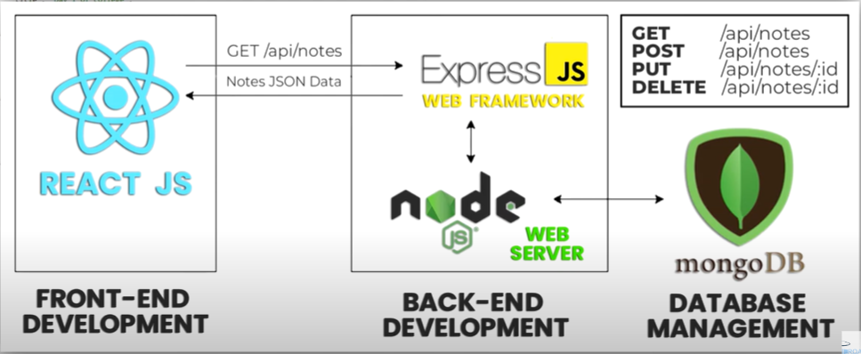

## Server & Installation Setup:

- To install node: `npm init` (we set server.js as starter file)
- npm i express
- To Run: `node server.js`
- Put the server.js file in backend folder
- Now to automate the process, in script (in package.json), write `"start": "node backend/server.js"`
- Now you can run server by just simply type: `node start`

## Creating Api EndPoints:
- 4 Types of Requests

- / is default api endpoint
- **api/notes** This api endpoint will take you to the notes

### Flow Diagram of our app

- Put port/anyother secure info in **env file** in variables and import it where required
- Run this command `npm i dotenv` to install dotenv package
- Also add **nodemon** package by running `install i nodemon` 
- Nodemon will run your server automatically, each time you make, changes you don't need to run the server again and again